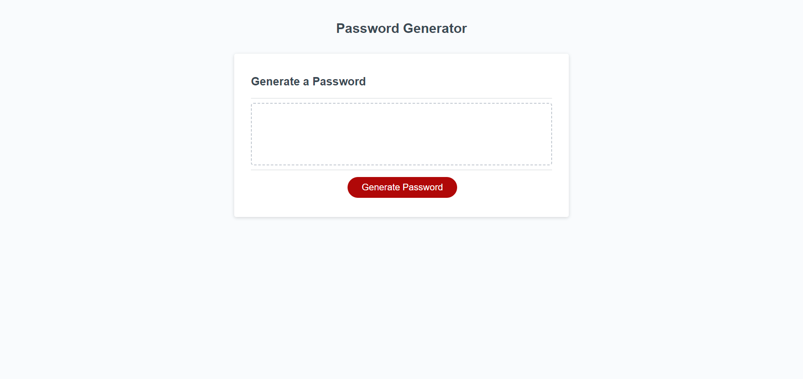

### Hello 👋
<h1>Welcome to the Generate Password App</h1> 
<h2>In this app you'll be asked in the first prompt to select a number of characters you wish to use in your password. If you choose a number less then 8 a error message will indicate that your input does not meet the criteria in order to generate your new password. The password must be between 8 - 28 characters in order to generate a new password.</h2>
<h3>A series of prompts will pop up asking you if you'd like Uppercase letters in your password, Lowercase letters in your password, Numbers in your password & Character Symbols in your password. You must answer yes to at least one of the prompts given in order to generate a new password.</h3>
<h3>Once you have completed answering all the pormpts correctly your password will be generated for you and you now have a new generated password filled in for you with a variety of letters, symbols and or numbers depending what your preference of characters you sujested to be generated</h3>
